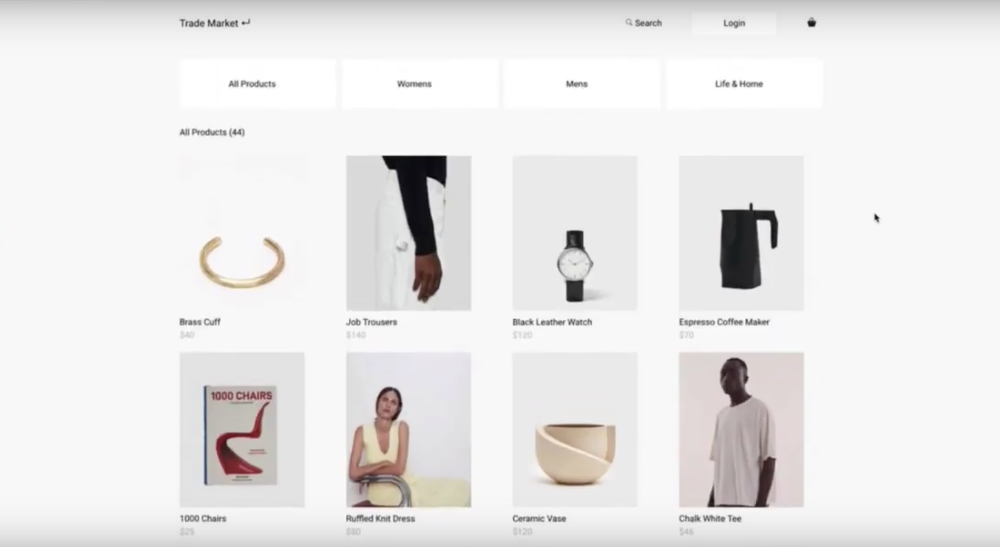

# E-commerce Marketplace Development
Video demo: https://youtu.be/rRFZT_hcI-E

An e-commerce marketplace developed with a team of three developers. The user can sign up and create a new product listing. The user can browse through all items other users are selling through multiple categories, visit user stores, add items to a shopping cart and purchase.

Technologies include: 

- React.js 
- Redux 
- CSS 
- Node.js 
- MongoDB 
- Express 
- Multer

